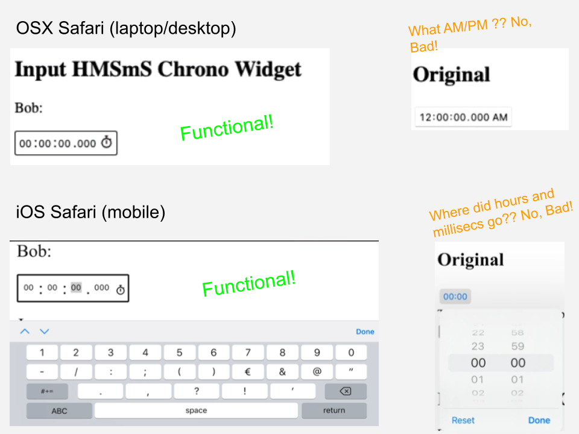

<div id="top"></div>

<!--
*** Thanks for checking out the Best-README-Template. If you have a suggestion
*** that would make this better, please fork the repo and create a pull request
*** or simply open an issue with the tag "enhancement".
*** Don't forget to give the project a star!
*** Thanks again! Now go create something AMAZING! :D
-->


<!-- PROJECT SHIELDS -->
<!--
*** I'm using markdown "reference style" links for readability.
*** Reference links are enclosed in brackets [ ] instead of parentheses ( ).
*** See the bottom of this document for the declaration of the reference variables
*** for contributors-url, forks-url, etc. This is an optional, concise syntax you may use.
*** https://www.markdownguide.org/basic-syntax/#reference-style-links
-->

[![npm bundle size][npm-bundle-size]][npm-bundle-size]
[![Contributors][contributors-shield]][contributors-url]
[![Forks][forks-shield]][forks-url]
[![Stargazers][stars-shield]][stars-url]
[![Issues][issues-shield]][issues-url]
[![MIT License][license-shield]][license-url]
[![RepoSize][reposize-shield]][reposize-url]


<!-- PROJECT LOGO -->
<br />
<div align="center">
  
  
  <a href="https://github.com/StephanLuis/input-duration">
   <h3 align="center">Input-Duration -- The best 'Time Only' Input</h3> 
  </a>

  

  <p align="center">A vanilla JS boosted input that works on Safari in very close imitation of a time input on Chrome <br>... only better. </p>
</div>

'Time Only' means that this control is for time as a unit, or a duration, like for count down timers.  Not for time of day nor date on a calendar, so no unwanted AM/PM conversions on Safari, no unwanted date-time selectors.  Just time up to 999 hrs and down to 1 millisecond.<br>
<p>
<div>
  </div>
    <div align="center">
  <a href="https://codesandbox.io/s/peaceful-waterfall-6mxpg2?file=/index.html" target="_blank">
  Fiddle
</a> ·
      <a href="https://6mxpg2.csb.app/" target="_blank">Demo</a>
    ·
  <a href="https://stephanluis.github.io/input-duration/" target="_blank">Docs</a>
  ·
    <a href="https://github.com/StephanLuis/input-duration/issues">Bugs</a>
    ·
    <a href="https://github.com/StephanLuis/input-duration/issues">Request Feature</a>
  </p>
  </div>
  Ok, what about mobile??  Yep, input-duration works on all popular operating system / browser combinations.  
<br/>
</div>
<br/>

<h2>Touch and Keyboard Timepicker</h2>

|OS(mobile)       | Browser       | | OS(laptop)  | Browser   |
|-----------------|----------------|--|-------------|-----------|
| Android  | Chrome   | |Windows  10, 11   |  Chrome, Edge  |
| iOS      | Safari, Chrome | |OsX             | Safari, Chrome |    

<!-- TABLE OF CONTENTS -->
<details>
  <summary>Table of Contents</summary>
  <ol>
    <li>
      <a href="#about-the-project">About The Project</a>
      <ul>
        <li><a href="#built-with">Built With</a></li>
      </ul>
    </li>
    <li>
      <a href="#getting-started">Getting Started</a>
      <ul>
        <li><a href="#prerequisites">Prerequisites</a></li>
        <li><a href="#installation">Installation</a></li>
      </ul>
    </li>
    <li><a href="#usage">Usage</a></li>
    <li><a href="#roadmap">Roadmap</a></li>
     <li><a href="#teststatus">Test Status</a></li>
    <li><a href="#contributing">Contributing</a></li>
    <li><a href="#license">License</a></li>
    <li><a href="#contact">Contact</a></li>
    <li><a href="#acknowledgments">Acknowledgments</a></li>
  </ol>
</details>


<!-- ABOUT THE PROJECT -->
## About The Project
Time inputs <input type='time'> are updated by browsers in unwanted ways!   Safari on desktop adds AM/PM if the user is in the USA and on mobile the cool scroll time selector does not allow fractions of a second.  The best html5 option doesn't cut it, sadly, so input-duration was designed and buit for a consistant UX no matter the browser, OS, or location settings.

<!-- [![Product Name Screen Shot][product-screenshot]](https://example.com) -->


<!-- [![HTML Screen Shot][html-screenshot]](https://example.com) -->

<h3> Bob is rescued by INPUT-DURATION! </h3>

The objective is a minimised javascript plugin that reproduces the behaviour of the input type=time on Chrome.  This way at least two of the major browsers are supported, Safari and Chrome, on desktop and mobile operating systems. 

<i>Does this loose any functionality?</i>  No!  document.querySelector('#bob').value  has a getter and setter!  So values can be set and retrieved by ID or attribute in HTML.



<!-- [![Safari Screen Shot][safari-screenshot]](https://example.com) -->

Yes! It seems CRAZY in 2022 that there is not a native 'time only' input for HTML.  What I mean is there is no user input control for time rendered independantly of date or time of day.  Yea, crazy, but now input-duration is a javascript plugin that creates a UX input control for a value of time simply as hours, minutes, seconds --<b>only</b>! <br> Ever thought, why is it difficult to 'code' a countdown timer? Why can't it be done with one control? Just look at google's timer and other coundown timers! All use multiple inputs, usually designed for integers.

The very worst is Safari on desktop and mobile, which undermine any input type=time coding efforts and update the input based on OS settings!  Shouldn't a user be able to 'scientifically' specify a period of time with one control?  <br>  Maybe it's just me, but the chrome / google timer is 14 separate elements ... those guys must be paid by the hour.   The closest HTML5 input type- time when configured with UX for hours to millisecs is very finicky and is rendered differently on Chrome than Safari. <b>Mobile</b> is different from laptop<br> ... so I've simplified that!


There were a few plugins that remediated the lack of continuity, but even those controls treated time as a date (ex 24hr max).  So it seems the current state is the most relable UX is multi input type number.  The worst example is the Google countdown timer.  That way is wrong because time is a basic unit that should be separate from calendar complexities.  That got me thinking, why isn't there an input control for it implemented across browsers??  I needed one, so coded input-duration.

Here's why:
* Time is hours minutes and seconds (and millisecs) and needn't be associated with part of a day or a date
* The date association breaks UX and is varied with browser implementation
* I found no other crossbrowser solution
* I thought this would be a great open source project
* End use of number inputs (standard hack) for use with time 

Of course, this is functional but in it's infancy.  Maybe, with some contribution this is a project that can inspire change to the HTML spec.


Feel free to vote for WhatWG inclusion of a into the HTML spec! (link comming soon)

<p align="right">(<a href="#top">back to top</a>)</p>


### Built With


* [Node.js](https://nodejs.org/)
* [Gitpod](https://www.gitpod.io/)
* [Testing Powered By SauceLabs](https://saucelabs.com)
* [Selenium](https://www.selenium.dev/)

input-duration is a module and works with webpack. Any add-ons/plugins used in dev are in the acknowledgements section.

<p align="right">(<a href="#top">back to top</a>)</p>


<!-- GETTING STARTED -->
## Getting Started

There are no pre-requisites for using input-duration if you're not compiling/ packaging you javascript.  If you are packaging:

### Prerequisites

This is an example of how to get started with npm and webpack, other frameworks should work too.
* npm & webpack
  ```sh
  npm install npm@latest -g
  npm init -y
  npm install webpack webpack-cli --save-dev
  ```

### Installation

With packaging:
_This template doesn't rely on any external dependencies or services._

1. Install from NPM
 ```sh
  npm i input-duration
 ```
2. import input-duration in javascript
 ```sh

 import id from 'input-duration';

```
  
Without packaging:

1. Add script:
 ```sh

<script type="module">

import chronlyhms from 'https://cdn.jsdelivr.net/npm/input-duration/+esm'
        
 </script>
  
 ```


<p align="right">(<a href="#top">back to top</a>)</p>


<!-- USAGE EXAMPLES -->
## Usage

input-duration requires a <input-duration> element .  There's no more HTML than that.  
```sh

<input-duration id='bob'></input-duration>

```

If you would like to get or set values or to disable input-duration elemet, javascipt can do that: 

```sh

document.querySelector('#bob').value = '44:04:04.444'

``` 

and

```sh

document.querySelector('#bob').disable()

```
so the inputs are modified.

_For more documentation, please refer to the jscocs on  [input-duration Docs](https://stephanluis.github.io/input-duration/)_

<p align="right">(<a href="#top">back to top</a>)</p>


<!-- ROADMAP -->
## Roadmap

- [x] Emperically determine <input type="time"> behaviour of Input (time) on Chrome
- [x] Reverse engineer input behaviour (arrows, digits, 0 addition, etc.)
- [x] Cross browser/ cross os manual tests  
- [ ] Get Chrome behavioural specification for <input type="time">
- [ ] Add end to end multi-browser, multi-os Selinium tests
- [ ] Update demo page (either PM.com or JSfiddle type)
- [ ] Multi-language documentation (Google translate of this page?)
    - [ ] Chinese
    - [ ] Spanish
- [ ] min and max values (sorry for the moment you'll have to do those yourself in js)

See the [open issues](https://github.com/StephanLuis/chronlyhms/issues) for a full list of proposed features (and known issues).

<p align="right">(<a href="#top">back to top</a>)</p>

<!-- TESTSTATUS -->
## Teststatus


[Tests & Live Status](https://github.com/StephanLuis/BrowserStackSelenium/blob/main/chronlyHMStests/README.md)


<!-- CONTRIBUTING -->
## Contributing

Contributions are what make the open source community such an amazing place to learn, inspire, and create. Any contributions you make are **greatly appreciated**.

If you have a suggestion that would make this better, please fork the repo and create a pull request. You can also simply open an issue with the tag "enhancement".
Don't forget to give the project a star! Thanks again!

1. Fork the Project
2. Create your Feature Branch (`git checkout -b feature/AmazingFeature`)
3. Commit your Changes (`git commit -m 'Add some AmazingFeature'`)
4. Push to the Branch (`git push origin feature/AmazingFeature`)
5. Open a Pull Request

<p align="right">(<a href="#top">back to top</a>)</p>


<!-- LICENSE -->
## License

Distributed under the MIT License. See [`LICENSE.txt`](https://github.com/StephanLuis/chronlyhms/blob/main/LICENSE)  for more information.

<p align="right">(<a href="#top">back to top</a>)</p>


<!-- CONTACT -->
## Contact

Stephan Luis - stephan@learnsense.org

Project Link: [https://github.com/StephanLuis/chronlyhms](https://github.com/StephanLuis/chronlyhms)

<p align="right">(<a href="#top">back to top</a>)</p>


<!-- ACKNOWLEDGMENTS -->
## Acknowledgments

Resources I've found helpful and would like to give credit to:


* [GitHub Pages](https://pages.github.com)
* [Font Awesome](https://fontawesome.com)
* [Best Readme](https://github.com/othneildrew/Best-README-Template)
* [Img Shields](https://shields.io)


<p align="right">(<a href="#top">back to top</a>)</p>


<!-- MARKDOWN LINKS & IMAGES -->
<!-- https://www.markdownguide.org/basic-syntax/#reference-style-links -->


[contributors-shield]: https://img.shields.io/github/contributors/StephanLuis/chronlyhms?style=for-the-badge
[contributors-url]: https://github.com/StephanLuis/chronlyhms/graphs/contributors
[forks-shield]: https://img.shields.io/github/forks/StephanLuis/chronlyhms?style=for-the-badge
[forks-url]: https://github.com/StephanLuis/chronlyhms/network/members
[stars-shield]: https://img.shields.io/github/stars/StephanLuis/chronlyhms?style=for-the-badge
[stars-url]: https://github.com/StephanLuis/chronlyhms/stargazers
[issues-shield]: https://img.shields.io/github/issues/StephanLuis/chronlyhms?style=for-the-badge
[issues-url]: https://github.com/StephanLuis/chronlyhms/issues
[license-shield]: https://img.shields.io/github/license/StephanLuis/chronlyhms?style=for-the-badge
[license-url]: https://github.com/StephanLuis/chronlyhms/blob/main/LICENSE
[reposize-shield]: https://img.shields.io/github/repo-size/stephanluis/chronlyhms?style=for-the-badge
[reposize-url]: https://github.com/StephanLuis/chronlyhms
[product-screenshot]: images/screenshot.png
[npm-bundle-size]: https://img.shields.io/bundlephobia/minzip/chronlyhms?style=for-the-badge
[teststatus-shield]: https://img.shields.io/badge/dynamic/json?url=https://app.saucelabs.com/u/stephanluis&label=Sauce%20Labs%20Status&color=brightgreen&style=for-the-badge&query=passing


[html-screenshot]: readme/html.png
[safari-screenshot]: readme/safariBad.png
